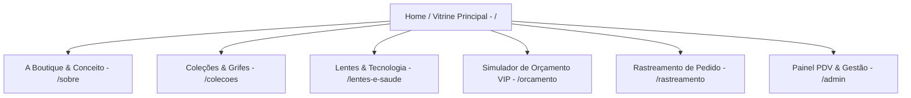

# Wireframe Textual e Arquitetura de Componentes — Timevision Ótica

Este documento apresenta a **estrutura completa de páginas, wireframe textual seção por seção e arquitetura de componentes** desenvolvida de acordo com as especificações do `TIMEVISION_MANUAL_DE_MARCA.md` e do `TIMEVISION_CONTEXTO_PARA_DESENVOLVIMENTO_WEB.md`.

---

## 🎨 1. Diretrizes de Design & Tokens da Marca

- **Posicionamento**: Boutique óptica de alto padrão no Recreio dos Bandeirantes (RJ), unindo sofisticação, curadoria de grifes internacionais e tecnologia avançada em lentes.
- **Estética Visual**: Luxuosa, editorial fashion e minimalista (P&B de alto contraste, textura de couro, detalhes metálicos em dourado `#B5996A`, pattern em losangos entrelaçados estilo monograma de grife).
- **Paleta de Cores Institucionais**:
  - `Off-white` (`#F9F7F8`): Fundo limpo e neutro.
  - `Grafite Escuro` (`#3D3D3D`): Cor de texto principal e logo positiva.
  - `Cinza Médio` (`#585858`): Textos de apoio e descrições.
  - `Dourado / Areia` (`#B5996A`): Cor de destaque/luxo (CTAs, bordas decorativas, badges VIP).
  - `Vinho Institucional` (`#900D13`): Badges e destaques institucionais.
  - `Azul Petróleo` (`#004168`): Seções de tecnologia em lentes e caixas de garantia.
- **Tipografia**:
  - `Soligant`: Wordmark da marca e títulos H1 de alto impacto.
  - `Identification 05C`: Taglines em caixa alta com tracking largo (`ÓTICA`, categorias, badges).
  - `Lora`: Corpo de texto, parágrafos, menus e botões gerais.

---

## 🗺️ 2. Arquitetura da Informação (Mapa do Site)

---

## 🧱 3. Mapeamento dos Componentes Reutilizáveis (UI System)

- **`HeaderNavbar`**: Navegação superior fixa com área de proteção (X) para a logo, links institucionais e botão de orçamento VIP.
- **`BrandLogo`**: Componente inteligente que renderiza as 3 variações oficiais (Principal horizontal, Secundária com box em "VISION", Monograma/Ícone) com box de contraste garantido quando sobreposto a fotos.
- **`ButtonCTA`**: Botão de ação com animação hover sofisticada (variantes: Gold `#B5996A`, Wine `#900D13`, Petrol `#004168`, Outline).
- **`ProductCard`**: Card em estilo editorial de moda para exibição de armações de grife com tag da marca, preço e botão de contato direto.
- **`PatternBackground`**: Textura sutil baseada na malha geométrica de losangos/diamantes da marca para fundos de transição.
- **`TestimonialCard`**: Prova social em card off-white com citação itálica em `Lora`, estrelas douradas e monograma em marca d'água.
- **`PrescriptionGrid`**: Tabela óptica para inserção e exibição de receita visual (OD/OE: Esférico, Cilíndrico, Eixo, Adição).

---

## 📐 4. Wireframe Textual Seção por Seção (Página por Página)

### 4.1 Página Inicial (`/`) — Vitrine Principal & Experiência Boutique

#### Seção 1: Header / Navbar Topo
- **Visual:** Fundo grafite (`#3D3D3D`) com sutil linha inferior dourada (`#B5996A`).
- **Elementos:** `BrandLogo` alinhada à esquerda com respiro de proteção X. Links de navegação em `Lora`. Botão *"Orçamento VIP"* em dourado.

#### Seção 2: Hero Section (Editorial Fashion & Boutique Atemporal)
- **Visual:** Banner full-width de `85vh`. Fotografia de campanha editorial em P&B de alto contraste (modelo com óculos de luxo).
- **Elementos:**
  - Badge em `Identification 05C`: *"BOUTIQUE ÓPTICA ATEMPORAL — RECREIO DOS BANDEIRANTES, RJ"*.
  - Título em `Soligant` / `Lora`: **"A Elegância que sua Visão Merece"**.
  - Subtítulo em `Lora`: *"Curadoria exclusiva de armações internacionais, lentes de altíssima precisão e atendimento personalizado."*
  - CTAs: Botão primário *"Solicitar Orçamento VIP"* (Dourado) + Botão secundário *"Conheça as Coleções"*.
  - Marca D'Água: Monograma da Timevision no canto inferior em 15% de opacidade.

#### Seção 3: Manifesto de Marca & Conceito (O Luxo de Enxergar Bem)
- **Visual:** Grid de 2 colunas em fundo Off-White (`#F9F7F8`).
- **Elementos:**
  - Coluna 1: Manifesto de marca destacando a localização no Recreio dos Bandeirantes, o atendimento boutique e os 8 pilares institucionais (*Compromisso, Ética, Seriedade, Verdade, etc.*).
  - Coluna 2: Mosaico fotográfico still-life (armações sobre couro e metal) com a `BrandLogo` aplicada sobre **Box Sólido Branco** para garantia de contraste.

#### Seção 4: Curadoria de Coleções em Destaque (Vitrine Interativa)
- **Visual:** Fundo grafite (`#3D3D3D`) com `PatternBackground` de losangos dourados em opacidade 5%.
- **Elementos:** Filtros interativos (*Todos, Feminino, Masculino, Solar, Titânio, Grifes*) + Grid de `ProductCard` (Ray-Ban, Tom Ford, Gucci, Timevision Signature) com CTA direto para WhatsApp.

#### Seção 5: Lentes de Alta Tecnologia (Qualidade & Transparência)
- **Visual:** Blocos contrastantes em Azul Petróleo (`#004168`) e Dourado (`#B5996A`).
- **Elementos:** Copywriting no tom de voz da marca (*"É de verdade! Transparência absoluta na procedência de suas lentes."*) + Cards tecnológicos (Zeiss DuraVision, Essilor Crizal Sapphire, Hoyalux Identity V+).

#### Seção 6: Atendimento Móvel & Ações Corporativas B2B / Igrejas
- **Visual:** Card em fundo Vinho Institucional (`#900D13`) com borda dourada.
- **Elementos:** Explication do programa de saúde visual itinerante para RH de empresas e lideranças religiosas.

#### Seção 7: Depoimentos & Prova Social (Instagram Highlights Style)
- **Visual:** Seção Off-White inspirada nos 5 destaques oficiais do Instagram da marca (*A Empresa, Orçamento aqui!, Entregas, Depoimentos, Clientes*) com fundo circular no pattern da marca + Carrossel de `TestimonialCard`.

#### Seção 8: Conteúdo Educativo / Blog / Dicas de Saúde Visual
- **Visual:** Cards informativos baseados em ganchos reais do manual (*"3 sinais que seus óculos venceram"*, *"Armação ideal para seu tipo de rosto"*).

#### Seção 9: Localização & Atendimento Agendado (Recreio dos Bandeirantes)
- **Visual:** Mapa interativo do Recreio dos Bandeirantes (RJ), dados de contato, horário e link do Instagram (`@oticastimevision`).

#### Seção 10: Footer / Rodapé Institucional
- **Visual:** Fundo grafite (`#3D3D3D`) com logo negativa branca/dourada e créditos da agência ThalitaKume®.

---

### 4.2 Página A Boutique / Sobre (`/sobre`)
- **Hero Page:** Imagem em P&B com monograma em marca d'água + Título *"A História da Timevision Ótica"*.
- **O Conceito Recreio:** História da boutique no Recreio dos Bandeirantes (RJ).
- **Os 8 Atributos:** Grid estilizado com as diretrizes do manual de marca (*Compromisso, Dedicação, Respeito, Ética, Responsabilidade, Honestidade, Seriedade e Verdade*).

---

### 4.3 Página Coleções & Grifes (`/colecoes`)
- **Filtros Avançados:** Por Grife (Ray-Ban, Tom Ford, Gucci, Prada, Oakley), Estilo e Material (Acetato Italiano, Titânio, Metal Dourado).
- **Galeria de Produtos:** Cards com iluminação de estúdio e CTA de orçamento instantâneo.

---

### 4.4 Página Lentes & Tecnologia (`/lentes-e-saude`)
- **Comparador Interativo de Lentes:** Escolha de necessidade refrativa e revestimentos antirreflexo/luz azul.
- **Selo de Certificação:** Garantia de autenticidade dos laboratórios parceiros.

---

### 4.5 Página Orçamento VIP & Receita (`/orcamento`)
- **Formulário Passo a Passo:** Dados pessoais → Upload ou preenchimento da receita visual (`PrescriptionGrid`) → Escolha da armação → Envio pré-formatado para o WhatsApp VIP.

---

### 4.6 Página Rastreamento de Pedido (`/rastreamento`)
- **Consulta por CPF ou N° da O.S.:** Linha do tempo visual dos estatus de confecção (*Pedido Recebido, No Laboratório, Em Montagem, Pronto para Entrega*) e resumo da receita visual.

---

### 4.7 Painel Administrativo & PDV Móvel (`/admin`)
- **Módulo Responsivo:** Para atendimento no celular/tablet em visitas itinerantes.
- **Abas Integradas:** Dashboard financeiro, Venda rápida (PDV), Banco de clientes, Estoque, Gerador de O.S. A6 em 2 vias (`WorkOrderGenerator`) e Gerador de Flyer de Marketing (`MarketingFlyer`).
