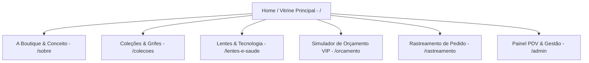

# Timevision Ótica — Estrutura de Páginas e Wireframe Textual Componentizado

> **Documento de Especificação de Interface e Arquitetura de Informação**  
> **Baseado em:** `TIMEVISION_MANUAL_DE_MARCA.md` e `TIMEVISION_CONTEXTO_PARA_DESENVOLVIMENTO_WEB.md`  
> **Posicionamento de Marca:** Boutique óptica de alto padrão (Recreio dos Bandeirantes, RJ) que combina sofisticação, curadoria de grifes, atendimento personalizado e tecnologia de ponta em lentes.  
> **Estética Visual:** Luxuosa, editorial fashion, minimalista (referências: P&B de alto contraste, textura de couro, detalhes em dourado `#B5996A`, pattern em losango de luxo).

---

## 1. Mapeamento de Design Tokens & Diretrizes de UI

Para garantir alinhamento estrito às diretrizes da agência ThalitaKume®, o sistema de UI deve utilizar os tokens institucionais:

### 1.1 Cores Institucionais
- **`--tv-off-white` (`#F9F7F8`)**: Fundo padrão claro do site (superfícies limpas, cards institucionais).
- **`--tv-graphite` (`#3D3D3D`)**: Cor de texto principal, títulos sobre fundo claro e cor da logo na versão positiva.
- **`--tv-gray-mid` (`#585858`)**: Texto secundário, legendas, bordas sutis e descrições.
- **`--tv-gold` (`#B5996A`)**: Cor primária de destaque/luxo (botões CTA principais, destaques, bordas finas decorativas, hover states, badges VIP).
- **`--tv-wine` (`#900D13`)**: Cor de destaque secundária (badges institucionais, etiquetas de oferta/lançamento, botões de ação especial).
- **`--tv-petrol` (`#004168`)**: Azul petróleo institucional (seções alternadas, selos de tecnologia em lentes, boxes de garantia).

### 1.2 Tipografia
- **Wordmark / Logotipo**: `Soligant` (Serifada clássica de alto contraste). *Uso exclusivo nos arquivos oficiais da marca e pontualmente em títulos de alto impacto (H1).*
- **Taglines & Badges**: `Identification 05C` (Sans-serif geométrica em caixa alta com `letter-spacing: 0.18em` a `0.25em`).
- **Corpo de Texto & Headings Gerais**: `Lora` (Serifada elegante, legível para parágrafos, botões e menus).

### 1.3 Elementos Gráficos Especiais
- **Box de Contraste**: Sempre que a logo for aplicada sobre imagens ou fundos fotográficos, utiliza-se um retângulo sólido (branco ou dourado) preservando a legibilidade.
- **Pattern de Losangos (Padronagem Gráfica)**: Malha geométrica entrelaçada estilo monograma de luxo. Usada como fundo sutil em seções de transição, destaques circulares e rodapé.
- **Marca d'Água**: Ícone/monograma aplicado discretamente em 15% a 20% de opacidade nos cantos de fotos de produto (still) e banners.

---

## 2. Arquitetura da Informação (Mapa do Site)

1. **`/` (Home / Vitrine Principal)** — Hero editorial P&B, manifesto de marca, curadoria de armações, exames e agendamento B2B/VIP.
2. **`/sobre` (A Boutique)** — História, localização no Recreio dos Bandeirantes, pilares institucionais e conceito atemporal.
3. **`/colecoes` (Catálogo de Grifes)** — Galeria estilo e-commerce de moda com filtros por formato de rosto, marca e estilo.
4. **`/lentes-e-saude` (Tecnologia Visual)** — Guia educativo de lentes (Zeiss, Essilor, Hoyalux), revestimentos e cuidados oftalmológicos.
5. **`/orcamento` (Atendimento Personalizado)** — Formulário interativo para envio de receita visual e solicitação de orçamento via WhatsApp VIP.
6. **`/rastreamento` (Consulta de O.S.)** — Portal do cliente para acompanhamento do status de confecção do óculos (recebido, laboratório, montagem, pronto).
7. **`/admin` (Painel PDV Móvel)** — Sistema interno para equipe de atendimento presencial/itinerante (clientes, estoque, vendas e gerador de O.S. A6 em 2 vias).

---

## 3. Biblioteca de Componentes Globais (Design System)

| Componente | Função | Props / Parâmetros Principais | Tokens Utilizados |
|---|---|---|---|
| `HeaderNavbar` | Cabeçalho fixo com navegação, busca rápida, seletor de agendamento e menu responsivo. | `variant` (transparent / solid), `activeRoute` | Fundo `#3D3D3D` ou Blur, Texto `#F9F7F8`, Destaque `#B5996A` |
| `BrandLogo` | Renderiza a logo oficial respeitando as 3 versões (Principal horizontal, Secundária com box em VISION, Ícone Monograma) com área de proteção (clear space X). | `version` ('primary' \| 'secondary' \| 'icon'), `colorScheme` ('dark' \| 'light' \| 'gold'), `width` | Área de respiro X resguardada, PNG/SVG oficial |
| `ButtonCTA` | Botão primário de ação com animação de hover elegante. | `variant` ('gold' \| 'wine' \| 'petrol' \| 'outline'), `size`, `icon`, `href` | `Lora` / `Identification 05C`, `#B5996A`, `#900D13` |
| `ProductCard` | Card visual de armação de grife com fotografia still P&B/colorida, preço, marca e CTA rápido. | `id`, `name`, `brand`, `price`, `imageUrl`, `tags` | Card `#F9F7F8`, Borda `#585858`/20, Badge `#B5996A` |
| `PatternBackground` | Overlay ou container de fundo aplicando a padronagem de losangos entrelaçados da marca. | `opacity` (0.05 a 0.2), `color` ('gold' \| 'white' \| 'black') | SVG do Pattern institucional |
| `TestimonialCard` | Card de prova social estilo editorial com citação, nome, cargo/local e foto. | `quote`, `author`, `role`, `stars` | Fonte `Lora` itálico, Aspas em `#B5996A` |
| `PrescriptionGrid` | Componente de tabela responsiva para inserção/exibição de receita óptica (OD/OE: Esférico, Cilíndrico, Eixo, Adição). | `data`, `editable` (boolean), `onChange` | Fundo `#3D3D3D`, Bordas `#B5996A` |

---

## 4. Wireframe Textual Seção por Seção (Página por Página)

---

### 4.1 Página Inicial (`/`) — Vitrine Principal & Experiência Boutique

#### Seção 1: Header / Navbar Topo
- **Layout:** Fundo escuro grafite (`#3D3D3D`) com linha inferior dourada de 1px (`#B5996A`). Logo alinhada à esquerda com margem interna de proteção X.
- **Componentes:** `BrandLogo` (versão horizontal principal), `HeaderNavbar` (Links: *A Boutique*, *Coleções*, *Lentes & Tecnologia*, *Rastreamento*), Botão `ButtonCTA` ("Orçamento VIP").
- **UX/Interação:** Em telas pequenas, converte o menu para um gaveteiro (Sheet/Drawer) com o monograma em destaque sobre o pattern institucional.

#### Seção 2: Hero Section (Editorial Fashion & Boutique Atemporal)
- **Layout:** Container full-width min-height `85vh`. Fundo com fotografia de campanha editorial em P&B de alto contraste (modelo usando óculos de sol/grau de grife em ambiente sofísticado). Overlay gradiente de grafite escuro com transparência.
- **Componentes:**
  - `Badge`: *"BOUTIQUE ÓPTICA ATEMPORAL — RECREIO DOS BANDEIRANTES, RJ"* (Fonte: `Identification 05C`, caixa alta, tracking `0.2em`, cor `#B5996A`).
  - `Title`: **"A Elegância que sua Visão Merece"** (Fonte: `Soligant` / `Lora`, tamanho `4xl` a `6xl`, cor `#F9F7F8`).
  - `Subtitle`: "Curadoria exclusiva de armações internacionais, lentes de altíssima precisão e atendimento personalizado com a exclusividade que você busca." (Fonte: `Lora`, cor `#F9F7F8`/90).
  - `CTA Group`:
    - Botão 1 (`ButtonCTA` Gold): *"Solicitar Orçamento VIP"* → Direciona para WhatsApp com mensagem pré-formatada.
    - Botão 2 (`ButtonCTA` Outline): *"Conheça as Coleções"* → Âncora para o catálogo.
  - `Marca D'Água`: Monograma da Timevision no canto inferior direito em opacidade 15%.

#### Seção 3: Manifesto de Marca & Conceito (O Luxo de Enxergar Bem)
- **Layout:** Grid de 2 colunas em fundo Off-White (`#F9F7F8`).
  - **Coluna 1 (Texto & Valores):**
    - Subtítulo: *"CONCEITO & EXCLUSIVIDADE"* (`Identification 05C`, `#B5996A`).
    - Título: **"Mais que uma Ótica, uma Experiência de Estilo e Saúde"** (`Lora` bold, `#3D3D3D`).
    - Parágrafos (`Lora` regular): "Localizada no coração do Recreio dos Bandeirantes, a Ótica Timevision une o frescor do litoral carioca à sofisticação das melhores grifes mundiais. Acreditamos que a saúde dos seus olhos deve ser acompanhada do mais alto padrão estético."
    - Pilares de Atributos: Lista com ícones dourados finos — *Compromisso*, *Ética*, *Tecnologia Refrativa*, *Atendimento Personalizado*.
  - **Coluna 2 (Visual Editorial):**
    - Mosaico de imagens em estilo still-life: óculos sobre textura de couro preto, detalhes de haste metálica e estojo de luxo.
    - `BrandLogo`: Aplicada no canto da foto dentro de um **Box Sólido Branco** (`#FFFFFF`) garantindo 100% de contraste conforme o manual de marca.

#### Seção 4: Curadoria de Coleções em Destaque (Vitrine Interativa)
- **Layout:** Container em fundo grafite escuro (`#3D3D3D`) com o `PatternBackground` (losangos dourados) em opacidade 5% no background.
- **Componentes:**
  - Título centralizado: **"Curadoria de Armações & Grifes"** (`Lora`, `#F9F7F8`).
  - Barra de Filtros rápidos: `[ Todos ]`, `[ Feminino ]`, `[ Masculino ]`, `[ Solar ]`, `[ Armações de Titânio ]`, `[ Linha Premium ]`.
  - Grid de `ProductCard` (4 colunas desktop / 2 mobile):
    - Foto do produto em destaque com iluminação de estúdio.
    - Tag da marca: ex.: *Ray-Ban*, *Tom Ford*, *Gucci*, *Timevision Signature*.
    - Nome do modelo e especificação do material (ex.: *Acetato Italiano polido à mão*).
    - Valor e parcelamento.
    - Botão hover: *"Tenho Interesse"* (ícone de WhatsApp).

#### Seção 5: Lentes de Alta Tecnologia (Qualidade Sem Concessões)
- **Layout:** Fundo neutro com blocos em tom **Azul Petróleo (`#004168`)** e **Dourado (`#B5996A`)**.
- **Conteúdo / Copywriting:**
  - Headline: **"Tecnologia Óptica em Lentes de Última Geração"**
  - Subtítulo com o tom de voz da marca: *"É de verdade! Transparência absoluta na procedência de suas lentes."*
  - Cards Informativos de Parceiros Tecnológicos:
    1. **Zeiss DuraVision**: Proteção contra luz azul digital, antirreflexo supremo e nitidez periférica.
    2. **Essilor Crizal Sapphire**: Resistência a arranhões, repelência a poeira e transparência invisível.
    3. **Hoyalux Identity V+**: Lentes multifocais personalizadas para o estilo de vida do usuário.
  - Tabela comparativa e selo de garantia de confecção.

#### Seção 6: Atendimento Móvel & Ações Corporativas B2B / Igrejas
- **Layout:** Card em destaque com borda dourada e fundo vinho institucional (`#900D13`) em degradê.
- **Conteúdo:**
  - Título: **"Saúde Visual Itinerante para Empresas, Igrejas e Comunidades"**
  - Descrição: "Levamos a estrutura completa da Timevision Ótica diretamente até a sua entidade. Consultas de optometria refrativa gratuitas para colaboradores e membros, com condições de fábrica."
  - Passos: 1. Agendamento → 2. Exame no Local → 3. Escolha de Armações → 4. Entrega Garantida.
  - CTA: Botão *"Agendar Ação Corporativa / Social"* (`ButtonCTA` Gold).

#### Seção 7: Depoimentos & Prova Social (Instagram Highlights Style)
- **Layout:** Seção em Off-White (`#F9F7F8`) destacando os 5 pilares do Instagram da marca (`@oticastimevision`):
  1. *A Empresa* (Ícone circular com Pattern Dourado)
  2. *Orçamento aqui!* (Pattern Preto/Branco)
  3. *Entregas* (Pattern Preto/Dourado)
  4. *Depoimentos* (Pattern Vermelho/Dourado)
  5. *Clientes* (Pattern Azul/Dourado)
- **Carrossel de `TestimonialCard`**: Depoimentos reais de clientes satisfeitos do Recreio dos Bandeirantes e região.

#### Seção 8: Conteúdo Educativo / Blog / Dicas de Saúde Visual
- **Layout:** Grid de 3 cards com ganchos inspirados nos posts reais da marca:
  - **Artigo 1:** *"3 sinais claros de que seus óculos de grau precisam ser trocados"*
  - **Artigo 2:** *"Como escolher a armação perfeita para o seu formato de rosto"*
  - **Artigo 3:** *"Fadiga ocular digital: como as lentes com filtro de luz azul protegem sua visão no trabalho"*

#### Seção 9: Localização & Atendimento Agendado (Recreio dos Bandeirantes)
- **Layout:** Container dividido — Lado esquerdo com mapa interativo do Recreio dos Bandeirantes, RJ. Lado direito com informações de contato.
- **Conteúdo:**
  - Endereço da Boutique / Ponto de Atendimento.
  - Telefone / WhatsApp VIP.
  - Horários de Funcionamento.
  - Link direto no Instagram: `@oticastimevision`.

#### Seção 10: Footer / Rodapé Institucional
- **Layout:** Fundo grafite escuro (`#3D3D3D`) com o `PatternBackground` em opacidade 10%.
- **Conteúdo:**
  - Logo oficial em versão negativa (branca/dourada).
  - Links de navegação rápida e políticas de privacidade.
  - Selo de Autenticidade: *"Timevision Ótica © 2026 — Todos os direitos reservados. Design & Identidade por ThalitaKume® Agency."*

---

### 4.2 Página A Boutique / Sobre (`/sobre`)

- **Hero Page:** Imagem em P&B com o monograma da marca em marca d'água + Título *"A História da Timevision Ótica"*.
- **O Conceito Recreio:** Texto focado no posicionamento boutique no bairro do Recreio dos Bandeirantes (RJ), destacando a curadoria atemporal de modelos.
- **Valores & Atributos:** Grid estilizado com as 8 diretrizes do manual de marca: *Compromisso, Dedicação, Respeito, Ética, Responsabilidade, Honestidade, Seriedade e Verdade*.
- **Galeria de Fotos do Espaço & Atendimento:** Mosaico em P&B e cores quentes mostrando a curadoria de armações e a tecnologia refrativa.

---

### 4.3 Página Coleções & Grifes (`/colecoes`)

- **Header de Categoria:** Filtros avançados por:
  - **Grife:** Ray-Ban, Tom Ford, Gucci, Prada, Oakley, Timevision Signature.
  - **Estilo:** Aviador, Gatinho, Retangular, Redondo, Oversized, Sem Aro.
  - **Material:** Acetato Italiano, Titânio, Metal Dourado, Fibra de Carbono.
- **Grid de Produtos:** Exibição dinâmica de armações com suporte a zoom na imagem still e botão de simulação no rosto / orçamento instantâneo.

---

### 4.4 Página Lentes & Tecnologia (`/lentes-e-saude`)

- **Comparador de Lentes:** Ferramenta visual onde o usuário escolhe seu grau e necessidade (Visão Simples, Multifocal, Antirreflexo, Fotocromática/Transitions) e vê os benefícios em tempo real.
- **Garantia de Autenticidade:** Explicação de como os certificados digitais dos laboratórios (Zeiss, Essilor, Hoyalux, Padrão, Haytek, Digilab) acompanham cada par de óculos entregue.

---

### 4.5 Página Orçamento VIP & Receita (`/orcamento`)

- **Passo 1:** Dados do Cliente (Nome, WhatsApp, E-mail, Bairro no RJ).
- **Passo 2:** Envio da Receita (Upload da foto da receita médica ou preenchimento da `PrescriptionGrid` com OD/OE).
- **Passo 3:** Escolha da Armação (Seleção do modelo do catálogo ou opção "Já tenho minha armação").
- **Passo 4:** Envio direto para o atendimento consultivo via WhatsApp com mensagem formatada para fechamento rápido.

---

### 4.6 Página Rastreamento de Pedido (`/rastreamento`)

- **Formulário de Busca:** Campo para digitação do CPF ou número da Ordem de Serviço (Ex.: `TV-1001`).
- **Stepper de Status de Confecção (Linha do Tempo):**
  1. `[x]` **Pedido Recebido** (Ordem registrada e conferida)
  2. `[x]` **Em Confecção no Laboratório** (Surfaçagem e tratamento das lentes)
  3. `[ ]` **Montagem & Controle de Qualidade** (Corte óptico e ajuste na armação)
  4. `[ ]` **Pronto para Entrega / Retirada** (Notificação ao cliente)
- **Resumo da O.S.:** Visualização digital simplificada dos dados da receita e especificações das lentes para conferência do cliente.

---

### 4.7 Painel Administrativo & PDV Móvel (`/admin`)

- **Interface Responsiva (Mobile First):** Desenvolvida para que os consultores utilizem no celular ou tablet durante atendimentos corporativos itinerantes.
- **Abas do Sistema:**
  1. **Visão Geral / Finanças:** Faturamento, Custos, Lucro Líquido, Margem Médial e Alertas de Estoque Baixo.
  2. **Venda Rápida (PDV):** Registro de novas vendas com seleção de cliente, armação, lente e cadastro imediato de receita visual (esférico, cilíndrico, eixo, adição).
  3. **Clientes:** Cadastro e histórico completo de compras e receitas por CPF.
  4. **Estoque:** Controle de armações e lentes com preço de custo, venda e margem comercial.
  5. **Gerador de Ordem de Serviço (`WorkOrderGenerator`):** Emissão em PDF da O.S. oficial A4 contendo 2 vias A6 idênticas (Via da Loja e Via do Cliente), com linhas de corte pontilhadas, dados da receita visual e termos de garantia.
  6. **Marketing (`MarketingFlyer`):** Gerador de materiais publicitários e banners promocionais com upload de foto e aplicação do pattern e logo oficiais da Timevision Ótica.

---

## 5. Matriz de Conformidade com o Manual de Marca

| Regra do Manual | Como foi Atendida nesta Especificação |
|---|---|
| **Cores Oficiais** | Uso exclusivo de `#F9F7F8`, `#3D3D3D`, `#585858`, `#B5996A`, `#900D13` e `#004168`. Sem adição de cores estranhas à paleta. |
| **Área de Proteção (Clear Space X)** | O componente `BrandLogo` impõe padding mínimo proporcional à largura da inicial/monograma. |
| **Aplicação sobre Fotos** | Obrigatório o uso do **Box Sólido de Contraste** (em branco ou dourado) atrás do logotipo em banners e imagens do hero section. |
| **Uso de Fontes** | `Soligant` para wordmark/headlines de impacto, `Identification 05C` para taglines em caixa alta e `Lora` para corpo de texto. |
| **Estética Luxo/Editorial** | Inspiração em moodboard de grifes de moda (P&B, couro, metalizado dourado, pattern de losangos). |
| **Tom de Voz** | Sincero, elegante e transparente ("É de verdade!"), combinando conteúdo educativo, autoridade refrativa e prova social. |

---
*Documento preparado para orientar a implementação técnica em React / Next.js / TailwindCSS no repositório da Timevision Ótica.*
