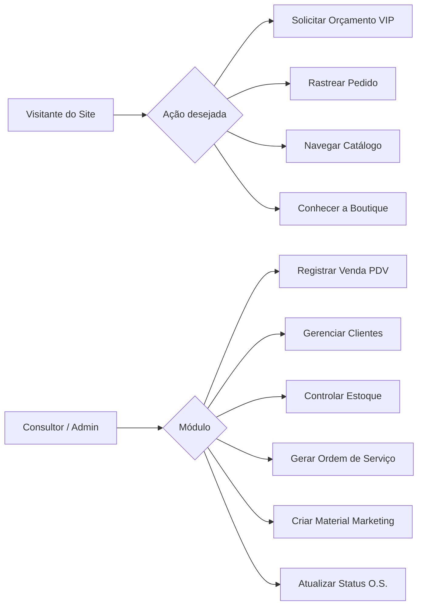

# Timevision Ótica — Fluxos de Usuário & Regras de Negócio

> **Documento de referência para lógica de negócio, jornadas do usuário e regras operacionais.**
> Define os fluxos passo a passo de cada funcionalidade principal do sistema.

---

## 1. Mapa de Fluxos



---

## 2. Fluxos do Site Público (Visitante / Cliente)

### 2.1 Fluxo: Solicitar Orçamento VIP (`/orcamento`)

```
ENTRADA: Visitante acessa /orcamento ou clica no CTA "Solicitar Orçamento VIP"

Passo 1 — Dados Pessoais
  ├── Campos: Nome*, WhatsApp*, E-mail, Bairro/Cidade
  ├── Validação: WhatsApp obrigatório (formato brasileiro)
  └── Ação: "Próximo"

Passo 2 — Receita Visual
  ├── Opção A: Upload de foto da receita médica (JPEG/PNG, máx 5MB)
  ├── Opção B: Preenchimento manual do PrescriptionGrid
  │     ├── OD: Esférico, Cilíndrico, Eixo
  │     ├── OE: Esférico, Cilíndrico, Eixo
  │     └── Adição (se multifocal)
  ├── Opção C: "Ainda não tenho receita" → exibe sugestão de agendamento
  └── Ação: "Próximo"

Passo 3 — Preferência de Armação
  ├── Opção A: Selecionar modelo do catálogo (grid de ProductCards)
  ├── Opção B: "Já tenho minha armação"
  ├── Opção C: "Quero ver opções presencialmente"
  └── Ação: "Enviar Orçamento"

Passo 4 — Envio via WhatsApp
  ├── Sistema monta mensagem pré-formatada:
  │     "Olá! Sou [Nome] e gostaria de um orçamento VIP. 🤓
  │      📋 Receita: OD [esf/cil/eixo] | OE [esf/cil/eixo] | Adição: [add]
  │      🕶️ Armação: [modelo selecionado ou 'já possuo']
  │      📍 Localização: [bairro/cidade]"
  ├── Abre WhatsApp Web/App com a mensagem preenchida
  └── Número destino: WhatsApp VIP da Timevision (configurado em `configuracoes`)

SAÍDA: Mensagem enviada ao WhatsApp da ótica para atendimento consultivo.
```

**Regras de negócio:**
- O formulário NÃO salva dados no banco (LGPD) — apenas formata e redireciona.
- Se o visitante anexar foto da receita, ela é convertida em base64 e incluída apenas na sessão.
- O tom da mensagem é elegante e amigável, sem abreviações excessivas.

---

### 2.2 Fluxo: Rastrear Pedido (`/rastreamento`)

```
ENTRADA: Cliente acessa /rastreamento

Passo 1 — Identificação
  ├── Campo: CPF ou Número da O.S. (ex: "TV-1001")
  ├── Validação: formato de CPF ou prefixo "TV-" + números
  └── Ação: "Consultar"

Passo 2 — Busca no Banco
  ├── Se encontrou: exibir resultado (Passo 3)
  ├── Se não encontrou: exibir mensagem amigável
  │     "Não encontramos um pedido com esse dado.
  │      Verifique o número ou entre em contato pelo WhatsApp."
  └── Busca: query por `clienteCpf` ou `id` na coleção `vendas`

Passo 3 — Exibição do Status (Stepper Visual)
  ├── Linha do Tempo com 5 etapas:
  │     ✅ Pedido Recebido (confirmado e conferido)
  │     ⏳ Em Confecção no Laboratório (surfaçagem e tratamento)
  │     ⏳ Montagem & Controle de Qualidade (corte óptico e ajuste)
  │     ⏳ Pronto para Entrega / Retirada
  │     ⏳ Entregue
  ├── Etapas concluídas: ícone ✅ verde, texto em peso bold
  ├── Etapa atual: ícone ⏳ dourado pulsante, destaque visual
  ├── Etapas futuras: ícone cinza, texto em tom secundário
  └── Resumo da O.S.: nome do cliente, itens, laboratório, previsão de entrega

SAÍDA: Visualização clara do progresso de fabricação dos óculos.
```

**Regras de negócio:**
- Busca é read-only — cliente não pode alterar dados.
- Múltiplos pedidos do mesmo CPF: exibir todos em lista, com o mais recente primeiro.
- Não exibir valores financeiros (preço, custo, lucro) na consulta pública.

---

### 2.3 Fluxo: Navegação do Catálogo (`/colecoes`)

```
ENTRADA: Visitante acessa /colecoes

Passo 1 — Exibição com Filtros
  ├── Filtros laterais/superiores:
  │     ├── Por Grife: [Todas] [Ray-Ban] [Tom Ford] [Gucci] [Prada] [Timevision Signature]
  │     ├── Por Tipo: [Grau] [Solar] [Clip-On]
  │     ├── Por Estilo: [Aviador] [Gatinho] [Retangular] [Redondo] [Oversized]
  │     └── Por Material: [Acetato] [Titânio] [Metal] [Fibra de Carbono]
  ├── Grid responsivo de ProductCards
  └── Ordenação: Relevância | Menor Preço | Maior Preço | Novidades

Passo 2 — Interação com Produto
  ├── Click no card: abre detalhes com galeria de fotos (zoom)
  ├── CTA "Tenho Interesse": abre WhatsApp com mensagem:
  │     "Olá! Vi o modelo [Nome do Produto] no site e tenho interesse. 🤓"
  └── Não há carrinho de compras — todo fechamento é consultivo via WhatsApp

SAÍDA: Visitante envia interesse ao WhatsApp para atendimento personalizado.
```

**Regras de negócio:**
- Catálogo lê dados da coleção `produtos` com `categoria = 'armacao'` e `ativo = true`.
- Preços são exibidos no site com parcelamento sugerido (até 12x).
- Estoque NÃO é exibido ao visitante — apenas "Disponível" ou "Sob Encomenda".

---

## 3. Fluxos do Painel Admin / PDV (`/admin`)

### 3.1 Fluxo: Autenticação

```
ENTRADA: Consultor acessa /admin

Cenário A — Sem Firebase (LocalStorage)
  ├── Credenciais estáticas: admin@timevision.com / timevision123
  ├── Flag de sessão: localStorage 'tv_admin_auth' = 'true'
  └── Logout: remove flag e redireciona ao login

Cenário B — Com Firebase
  ├── signInWithEmailAndPassword(auth, email, password)
  ├── Sessão mantida pelo Firebase Auth
  └── Logout: signOut(auth) + limpar estado local
```

**Regras de segurança:**
- Todas as rotas do admin verificam autenticação antes de renderizar.
- Sessão expira ao fechar o navegador (não persiste entre sessões por padrão).
- Em modo Firebase, as Firestore Security Rules protegem os dados server-side.

---

### 3.2 Fluxo: Venda Rápida (PDV) — Registro de Nova Venda

```
ENTRADA: Consultor navega para aba "Venda Rápida (PDV)"

Passo 1 — Selecionar Cliente
  ├── Dropdown com lista de clientes cadastrados
  ├── Busca por nome ou CPF (filtro em tempo real)
  ├── Se cliente não existe: botão "Novo Cliente" (abre modal de cadastro rápido)
  └── Validação: obrigatório selecionar cliente

Passo 2 — Selecionar Produtos
  ├── Dropdown "Armação": filtra produtos com categoria = 'armacao'
  │     Exibe: nome, quantidade em estoque, preço de venda
  ├── Dropdown "Lente": filtra produtos com categoria = 'lente'
  │     Exibe: nome, quantidade em estoque, preço de venda
  ├── Valor Total: calculado automaticamente (armação + lente)
  └── Validação: ao menos 1 produto selecionado

Passo 3 — Preencher Receita Visual
  ├── Grid de receita (PrescriptionGrid):
  │     OD: Esférico, Cilíndrico, Eixo
  │     OE: Esférico, Cilíndrico, Eixo
  │     Adição (para perto)
  └── Todos os campos são texto livre (aceitam "+", "-", valores decimais)

Passo 4 — Registrar Venda
  ├── Click em "Registrar Venda & Abrir O.S."
  ├── Sistema executa:
  │     1. Cria registro de Venda com status "recebido"
  │     2. Decrementa estoque dos produtos selecionados
  │     3. Salva a receita visual vinculada à venda
  │     4. Atualiza campo `ultimaReceita` do cliente
  │     5. Gera número sequencial da O.S. (prefixo + próximo número)
  │     6. Redireciona para o WorkOrderGenerator (geração de PDF)
  └── Toast de confirmação: "Venda registrada com sucesso!"

SAÍDA: PDF da Ordem de Serviço gerado e pronto para impressão.
```

**Regras de negócio:**
- Estoque é decrementado IMEDIATAMENTE ao registrar a venda (otimistic update).
- Se o estoque de um produto chegar a 0, ele ainda aparece no dropdown mas com "(Sem estoque)".
- O número da O.S. é sequencial e nunca se repete: TV-1001, TV-1002, TV-1003...
- O snapshot dos dados do cliente é salvo na venda para que a O.S. permaneça consistente mesmo se o cliente alterar seus dados depois.

---

### 3.3 Fluxo: Geração da Ordem de Serviço (PDF)

```
ENTRADA: Após registro de venda ou clique em "Re-gerar O.S." na tabela de pedidos

Composição do PDF (formato A4 com 2 vias A6):
  ┌───────────────────────────────────────┐
  │  VIA DA ÓTICA (A6 superior)           │
  │  ┌─────────────────────────────────┐  │
  │  │ Logo Timevision                 │  │
  │  │ ORDEM DE SERVIÇO Nº TV-XXXX    │  │
  │  │ Data: DD/MM/AAAA               │  │
  │  │                                 │  │
  │  │ CLIENTE                         │  │
  │  │ Nome: ___________               │  │
  │  │ CPF: ____________               │  │
  │  │ Tel: _____________              │  │
  │  │                                 │  │
  │  │ RECEITA VISUAL                  │  │
  │  │ ┌──────┬──────┬─────┬──────┐   │  │
  │  │ │      │ Esf. │ Cil.│ Eixo │   │  │
  │  │ │ OD   │      │     │      │   │  │
  │  │ │ OE   │      │     │      │   │  │
  │  │ │ Ad.  │      │     │      │   │  │
  │  │ └──────┴──────┴─────┴──────┘   │  │
  │  │                                 │  │
  │  │ PRODUTOS                        │  │
  │  │ - Armação: _________ R$ XX,XX   │  │
  │  │ - Lente: ___________ R$ XX,XX   │  │
  │  │ TOTAL: R$ XXX,XX               │  │
  │  │                                 │  │
  │  │ Garantia: XX dias               │  │
  │  └─────────────────────────────────┘  │
  │ ┈ ┈ ┈ ┈ CORTE AQUI ┈ ┈ ┈ ┈ ┈ ┈ ┈ ┈ │  ← Linha pontilhada de corte
  │  VIA DO CLIENTE (A6 inferior)         │
  │  (Conteúdo idêntico à via da ótica)   │
  └───────────────────────────────────────┘

Ação: Botão "Baixar PDF" → download local
Ação: Botão "Voltar ao Painel" → retorna à aba de Visão Geral
```

**Regras de negócio:**
- A O.S. sempre contém 2 vias idênticas em A6 dentro de uma folha A4.
- A via superior é a "Via da Ótica" (fica na loja), a inferior é a "Via do Cliente".
- Linha pontilhada de corte entre as duas vias.
- O PDF é gerado client-side via `jsPDF` (sem necessidade de servidor).
- Texto de garantia padrão: "Garantia de [XX] dias contra defeito de fabricação das lentes."

---

### 3.4 Fluxo: Gestão de Clientes

```
CRIAR CLIENTE:
  1. Click em "+ Novo Cliente"
  2. Modal com campos: Nome*, CPF*, E-mail, Telefone*, Endereço
  3. Validação de CPF (formato + dígitos verificadores)
  4. Salvar → saveItem('clientes', clienteData)
  5. Toast: "Cliente salvo com sucesso!"

EDITAR CLIENTE:
  1. Click no ícone de edição (✏️) no card do cliente
  2. Modal pré-preenchido com dados atuais
  3. Alterar campos → Salvar (mesmo fluxo de criação, com ID existente)

EXCLUIR CLIENTE:
  1. Click no ícone de lixeira (🗑️)
  2. Confirmação: "Tem certeza que deseja remover este cliente?"
  3. Confirmar → deleteItem('clientes', id)
  4. Toast: "Cliente excluído do sistema."

VISUALIZAR HISTÓRICO:
  1. No card do cliente, exibir lista de vendas/OS vinculadas
  2. Exibir última receita visual registrada
  3. Link rápido para re-gerar qualquer O.S. do histórico
```

---

### 3.5 Fluxo: Controle de Estoque

```
ADICIONAR PRODUTO:
  1. Click em "+ Novo Produto"
  2. Modal com campos: Nome*, Categoria*, Quantidade*, Preço Custo*, Preço Venda*
  3. Campos opcionais: Marca, Modelo, Material
  4. Salvar → saveItem('produtos', produtoData)

CÁLCULOS AUTOMÁTICOS:
  Margem de Lucro (%) = ((precoVenda - precoCusto) / precoVenda) × 100
  Lucro Unitário (R$) = precoVenda - precoCusto

ALERTAS DE ESTOQUE BAIXO:
  Se produto.quantidade <= configuracoes.limiteEstoqueBaixo (default: 3):
    → Exibir badge "⚠️ Estoque Baixo" no card do produto
    → Exibir alerta global no Dashboard: "X produtos com estoque baixo"
    → Cor do badge: amarelo/warning

CATEGORIAS VÁLIDAS:
  - 'armacao'        → Armações de grau e solar
  - 'lente'          → Lentes oftálmicas (grau)
  - 'lente_contato'  → Lentes de contato
  - 'acessorio'      → Estojos, cordões, flanelas, soluções
  - 'outro'          → Itens diversos
```

---

### 3.6 Fluxo: Atualização de Status (Rastreamento Interno)

```
ENTRADA: Consultor na aba "Visão Geral", tabela de Pedidos

Transições válidas (linear):
  recebido → laboratorio → montagem → pronto → entregue

Para cada transição:
  1. Selecionar novo status no dropdown da tabela
  2. Sistema executa updateItemStatus('vendas', vendaId, newStatus)
  3. (Futuro) Registrar em historicoStatus[] com timestamp
  4. Toast: "Status atualizado para [novo status]"

Status especial:
  'cancelado' → pode ser aplicado a partir de qualquer status
  → Não reverte o estoque automaticamente (decisão manual do admin)
```

---

### 3.7 Fluxo: Calculadora de Custo/Lucro (Dashboard)

```
MÉTRICAS EXIBIDAS NO DASHBOARD:

  Faturamento Total = Σ vendas.valorTotal
  Custo Total       = Σ vendas.custoTotal
  Lucro Líquido     = Faturamento Total - Custo Total
  Margem Comercial  = (Lucro Líquido / Faturamento Total) × 100

  Estoque Baixo     = count(produtos WHERE quantidade <= limiteEstoqueBaixo)

FILTROS (futuro):
  - Por período: Hoje | Última Semana | Último Mês | Personalizado
  - Por consultor: Todos | [Nome do Vendedor]
  - Por status: Todos | Em Andamento | Entregues | Cancelados
```

---

## 4. Regras Gerais do Sistema

### 4.1 Numeração de O.S.
- Formato: `[PREFIXO]-[SEQUENCIAL]` (ex: TV-1001, TV-1002)
- Prefixo configurável em `configuracoes.prefixoOS` (default: "TV")
- Sequencial nunca decresce e nunca se repete
- Armazenado em `configuracoes.proximoNumeroOS` ou `localStorage('tv_proximo_os')`

### 4.2 Snapshots de Dados
- Ao criar uma venda, os dados do cliente (nome, CPF, telefone, endereço) são **copiados** para o registro da venda.
- Isso garante que a O.S. impressa permanece fiel ao momento da venda, mesmo que o cliente altere seus dados posteriormente.

### 4.3 Decremento de Estoque
- O estoque é decrementado **no momento do registro da venda**, não na entrega.
- Produtos com estoque 0 continuam visíveis no PDV mas com indicação visual de esgotamento.
- Não há bloqueio automático de venda com estoque 0 (o consultor pode vender "sob encomenda").

### 4.4 LGPD / Privacidade
- Dados de CPF e receita visual são dados pessoais sensíveis.
- O formulário público de orçamento (`/orcamento`) **não armazena dados** — apenas redireciona para WhatsApp.
- Dados cadastrais no admin são protegidos por autenticação.
- (Futuro) Implementar opção de "exclusão de dados do cliente" para atender solicitações de titulares.

### 4.5 Atendimento Corporativo / Itinerante
- Vendas realizadas fora da loja devem registrar o campo `localAtendimento`:
  - "Corporativo - [Nome da Empresa]"
  - "Igreja - [Nome da Comunidade]"
  - "Associação - [Nome]"
- Isso permite relatórios futuros de performance por canal de atendimento.

---

*Referência: lógica existente em `src/app/admin/page.tsx` e `src/lib/firebase.ts`*
