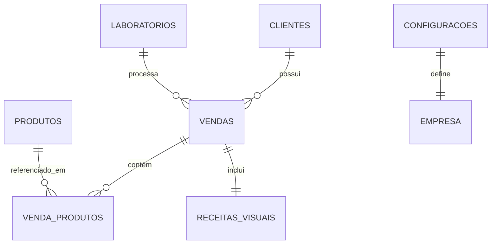

# Timevision Ótica — Modelo de Dados (Firebase / Firestore + LocalStorage)

> **Documento de referência para a estrutura de dados do sistema.**
> Define as coleções, campos, tipos, índices e regras de segurança para o Firestore,
> com mapeamento direto para o fallback em LocalStorage.

---

## 1. Visão Geral da Arquitetura de Dados



### Coleções no Firestore

| Coleção | Chave LocalStorage | Descrição |
|---|---|---|
| `clientes` | `tv_clientes` | Cadastro completo de clientes da ótica |
| `produtos` | `tv_produtos` | Estoque de armações, lentes e acessórios |
| `vendas` | `tv_vendas` | Registro de vendas com receita visual embutida |
| `laboratorios` | `tv_laboratorios` | Laboratórios parceiros (Zeiss, Essilor, etc.) |
| `configuracoes` | `tv_configuracoes` | Dados da empresa, configs gerais do sistema |

---

## 2. Schemas Detalhados

### 2.1 Coleção: `clientes`

```typescript
interface Cliente {
  // ─── Identificação ───
  id: string;              // Auto-gerado: "cli-XXXX" (LocalStorage) ou Firestore doc ID
  nome: string;            // Nome completo do cliente (obrigatório)
  cpf: string;             // CPF formatado "XXX.XXX.XXX-XX" (obrigatório, único)

  // ─── Contato ───
  email: string;           // E-mail para comunicação e envio de OS digital
  telefone: string;        // Telefone/WhatsApp no formato "(XX) XXXXX-XXXX"
  endereco: string;        // Endereço completo (rua, número, bairro, cidade-UF)

  // ─── Metadados ───
  criadoEm: string;        // ISO 8601 timestamp de criação
  atualizadoEm?: string;   // ISO 8601 timestamp da última atualização
  observacoes?: string;    // Notas livres do atendente sobre o cliente

  // ─── Dados Ópticos (histórico mais recente) ───
  ultimaReceita?: ReceitaVisual;   // Cópia da receita visual mais recente
  dataUltimaCompra?: string;       // Data da última compra (ISO date)
}
```

**Regras de validação:**
- `nome`: obrigatório, min 3 caracteres
- `cpf`: obrigatório, validação de formato (XXX.XXX.XXX-XX) e dígitos verificadores
- `email`: opcional, validação de formato
- `telefone`: obrigatório para contato via WhatsApp

**Índices Firestore recomendados:**
- `cpf` (único) — busca rápida por CPF no rastreamento e PDV
- `nome` (ASC) — listagem alfabética
- `criadoEm` (DESC) — clientes mais recentes primeiro

---

### 2.2 Coleção: `produtos`

```typescript
interface Produto {
  // ─── Identificação ───
  id: string;                      // Auto-gerado: "prod-XXXX"
  nome: string;                    // Nome do produto (ex: "Ray-Ban Aviator Classic")
  codigo?: string;                 // Código interno ou SKU (opcional)

  // ─── Classificação ───
  categoria: 'armacao' | 'lente' | 'acessorio' | 'lente_contato' | 'outro';
  marca?: string;                  // Ex: "Ray-Ban", "Tom Ford", "Zeiss", "Essilor"
  modelo?: string;                 // Ex: "RB3025", "DuraVision BlueControl"
  material?: string;               // Ex: "Acetato Italiano", "Titânio", "Policarbonato"

  // ─── Estoque ───
  quantidade: number;              // Quantidade em estoque (≥ 0)
  quantidadeMinima?: number;       // Limiar de alerta de estoque baixo (default: 3)

  // ─── Financeiro ───
  precoCusto: number;              // Preço de custo/aquisição (R$)
  precoVenda: number;              // Preço de venda ao consumidor (R$)
  margemLucro?: number;            // Calculado: ((precoVenda - precoCusto) / precoVenda) * 100

  // ─── Metadados ───
  ativo?: boolean;                 // Se o produto está ativo no catálogo (default: true)
  imagemUrl?: string;              // URL da foto do produto (still de estúdio)
  criadoEm?: string;               // ISO 8601
  atualizadoEm?: string;           // ISO 8601

  // ─── Detalhes Ópticos (somente para lentes) ───
  laboratorioId?: string;          // ID do laboratório que processa esta lente
  tipoLente?: 'visao_simples' | 'multifocal' | 'bifocal' | 'progressiva';
  revestimentos?: string[];        // Ex: ["antirreflexo", "blue_control", "fotocromatica"]
  indiceRefracao?: string;         // Ex: "1.56", "1.61", "1.67", "1.74"
}
```

**Regras de validação:**
- `nome`: obrigatório
- `precoVenda`: obrigatório, > 0
- `precoCusto`: obrigatório, ≥ 0
- `quantidade`: obrigatório, ≥ 0
- `margemLucro`: campo calculado, não editável diretamente

**Índices Firestore:**
- `categoria` (filtro) + `nome` (ASC) — busca por tipo de produto
- `quantidade` (ASC) — identificar estoque baixo
- `marca` (filtro) — filtro por grife

---

### 2.3 Sub-tipo: `ReceitaVisual` (embutido em Venda e Cliente)

```typescript
interface ReceitaVisual {
  // ─── Olho Direito (OD) ───
  esfericoOD: string;       // Grau esférico OD (ex: "+1.25", "-2.50")
  cilindricoOD: string;     // Grau cilíndrico/astigmatismo OD (ex: "-0.75")
  eixoOD: string;           // Eixo do cilíndrico OD em graus (ex: "90", "180")

  // ─── Olho Esquerdo (OE) ───
  esfericoOE: string;       // Grau esférico OE
  cilindricoOE: string;     // Grau cilíndrico OE
  eixoOE: string;           // Eixo OE

  // ─── Campos Adicionais ───
  adicao?: string;          // Adição para perto (multifocais/progressivas) (ex: "+2.00")
  dnp?: string;             // Distância naso-pupilar em mm (ex: "32/31")
  alturaSegmento?: string;  // Altura do segmento em mm (multifocais)

  // ─── Metadados da Receita ───
  medicoNome?: string;      // Nome do oftalmologista
  medicoCRM?: string;       // CRM do médico
  dataReceita?: string;     // Data da receita (ISO date)
  validadeReceita?: string; // Validade da receita (ISO date, geralmente +1 ano)
  imagemReceita?: string;   // URL da foto/upload da receita original
}
```

---

### 2.4 Coleção: `vendas` (Ordem de Serviço)

```typescript
interface Venda {
  // ─── Identificação da O.S. ───
  id: string;                      // Número da O.S.: "TV-1001" (sequencial)
  numeroOS?: string;               // Alias legível: "TV-1001"

  // ─── Dados do Cliente (snapshot no momento da venda) ───
  clienteId: string;               // Referência ao documento do cliente
  clienteNome: string;             // Nome (snapshot)
  clienteCpf: string;              // CPF (snapshot)
  clienteEmail: string;            // Email (snapshot)
  clienteEndereco: string;         // Endereço (snapshot)
  clienteTelefone: string;         // Telefone (snapshot)

  // ─── Itens da Venda ───
  produtos: VendaProduto[];        // Lista de itens vendidos

  // ─── Financeiro ───
  valorTotal: number;              // Soma dos preços de venda
  custoTotal: number;              // Soma dos preços de custo
  lucroTotal: number;              // valorTotal - custoTotal
  desconto?: number;               // Desconto aplicado (R$)
  valorFinal?: number;             // valorTotal - desconto
  formaPagamento?: 'dinheiro' | 'pix' | 'cartao_credito' | 'cartao_debito' | 'parcelado';
  parcelas?: number;               // Número de parcelas (se parcelado)

  // ─── Receita Visual ───
  receita: ReceitaVisual;

  // ─── Status de Confecção (Rastreamento) ───
  status: 'recebido' | 'laboratorio' | 'montagem' | 'pronto' | 'entregue' | 'cancelado';
  historicoStatus?: StatusLog[];   // Log de transições de status

  // ─── Laboratório ───
  laboratorioId?: string;          // ID do laboratório que processa as lentes
  laboratorioNome?: string;        // Nome do laboratório (snapshot)
  previsaoEntrega?: string;        // Data prevista de entrega (ISO date)

  // ─── Datas ───
  dataVenda: string;               // Data da venda (ISO date: "2026-07-03")
  dataEntrega?: string;            // Data real de entrega (ISO date)
  criadoEm?: string;               // ISO 8601 timestamp
  atualizadoEm?: string;           // ISO 8601 timestamp

  // ─── Atendimento ───
  vendedorNome?: string;           // Nome do consultor/atendente
  localAtendimento?: string;       // "Loja" | "Corporativo - [Nome da Empresa]" | "Igreja - [Nome]"
  observacoes?: string;            // Notas livres sobre o pedido
}

interface VendaProduto {
  id: string;                      // Referência ao produto
  nome: string;                    // Nome do produto (snapshot)
  quantidade: number;              // Quantidade vendida deste item
  precoVenda: number;              // Preço unitário de venda
  precoCusto: number;              // Preço unitário de custo
}

interface StatusLog {
  status: string;                  // O status para o qual transitou
  dataHora: string;                // ISO 8601 timestamp da transição
  observacao?: string;             // Nota opcional sobre a mudança
}
```

**Regras de validação:**
- `clienteId`: obrigatório, deve referenciar um cliente existente
- `produtos`: ao menos 1 item
- `valorTotal`: calculado automaticamente = soma de (produto.precoVenda * produto.quantidade)
- `custoTotal`: calculado automaticamente = soma de (produto.precoCusto * produto.quantidade)
- `lucroTotal`: calculado = valorTotal - custoTotal
- `status`: transições válidas: recebido → laboratorio → montagem → pronto → entregue

**Índices Firestore:**
- `clienteId` + `dataVenda` (DESC) — histórico de compras por cliente
- `status` + `dataVenda` (DESC) — filtro por status no rastreamento
- `dataVenda` (DESC) — listagem cronológica

---

### 2.5 Coleção: `laboratorios`

```typescript
interface Laboratorio {
  id: string;                      // Auto-gerado
  nome: string;                    // Ex: "Zeiss", "Essilor", "Hoyalux", "Padrão", "Haytek", "Digilab"
  tipo: 'nacional' | 'internacional';
  contato?: string;                // Telefone/e-mail do representante
  prazoMedio?: number;             // Prazo médio de entrega em dias úteis
  especialidades?: string[];       // Ex: ["multifocal", "alta_curvatura", "thin_lens"]
  ativo: boolean;                  // Se o laboratório está ativo na parceria
  logoUrl?: string;                // URL do logo do laboratório
}
```

**Laboratórios iniciais (pré-cadastrados):**

| Nome | Tipo | Prazo Médio | Especialidades |
|---|---|---|---|
| Zeiss | Internacional | 7-10 dias | Multifocal, DuraVision, BlueControl |
| Essilor | Internacional | 5-8 dias | Crizal, Varilux, Transitions |
| Hoyalux | Internacional | 7-10 dias | Multifocal Identity, Hi-Vision |
| Padrão | Nacional | 3-5 dias | Visão simples, surfaçagem básica |
| Haytek | Nacional | 3-5 dias | Policarbonato, tratamentos AR |
| Digilab | Nacional | 4-6 dias | Digital freeform, progressivas |

---

### 2.6 Coleção: `configuracoes`

```typescript
interface ConfiguracaoEmpresa {
  id: 'empresa';                   // Documento único
  nomeFantasia: string;            // "Timevision Ótica"
  razaoSocial?: string;            // Razão social legal
  cnpj?: string;                   // CNPJ formatado
  inscricaoEstadual?: string;
  endereco: string;                // Endereço completo da sede
  telefone: string;                // Telefone principal
  whatsapp: string;                // WhatsApp para contato VIP
  email: string;                   // E-mail institucional
  instagram: string;               // Handle: "@oticastimevision"
  website?: string;                // URL do site

  // ─── Configurações de O.S. ───
  prefixoOS: string;               // Prefixo para numeração das O.S. (ex: "TV")
  proximoNumeroOS: number;         // Próximo número sequencial (ex: 1003)
  termosGarantia: string;          // Texto padrão de garantia impresso na O.S.
  prazoGarantiaDias: number;       // Prazo padrão de garantia em dias (ex: 90)

  // ─── Configurações de Alerta ───
  limiteEstoqueBaixo: number;      // Limiar para alerta de estoque baixo (default: 3)
}
```

---

## 3. Chaves de LocalStorage (Modo Offline)

Quando o Firebase não está configurado (sem variáveis de ambiente), o sistema utiliza LocalStorage como banco de dados local.

| Chave | Tipo | Coleção Equivalente |
|---|---|---|
| `tv_clientes` | `Cliente[]` | `clientes` |
| `tv_produtos` | `Produto[]` | `produtos` |
| `tv_vendas` | `Venda[]` | `vendas` |
| `tv_laboratorios` | `Laboratorio[]` | `laboratorios` |
| `tv_configuracoes` | `ConfiguracaoEmpresa` | `configuracoes` |
| `tv_admin_auth` | `"true" \| null` | — (flag de sessão) |
| `tv_proximo_os` | `number` | — (sequencial de O.S.) |

---

## 4. Regras de Segurança Firestore (Sugestão)

```javascript
rules_version = '2';
service cloud.firestore {
  match /databases/{database}/documents {

    // Apenas usuários autenticados podem ler/escrever
    match /clientes/{clienteId} {
      allow read, write: if request.auth != null;
    }

    match /produtos/{produtoId} {
      allow read, write: if request.auth != null;
    }

    match /vendas/{vendaId} {
      allow read, write: if request.auth != null;
    }

    match /laboratorios/{labId} {
      allow read: if true;  // Público (mostrado no site)
      allow write: if request.auth != null;
    }

    match /configuracoes/{configId} {
      allow read: if true;  // Público (dados da empresa para o site)
      allow write: if request.auth != null;
    }
  }
}
```

---

## 5. Migração: LocalStorage → Firebase

Quando as credenciais do Firebase forem configuradas pela primeira vez, executar a seguinte sequência de migração:

1. Verificar se existem dados em `localStorage` (`tv_clientes`, `tv_produtos`, `tv_vendas`)
2. Para cada coleção, iterar os itens locais e salvar no Firestore via `setDoc()`
3. Após migração bem-sucedida, marcar flag `tv_migrated = true` no localStorage
4. Não apagar dados locais imediatamente (manter como backup por 30 dias)

---

*Referência: tipos existentes em `src/lib/firebase.ts` (interfaces Cliente, Produto, ReceitaVisual, Venda)*
